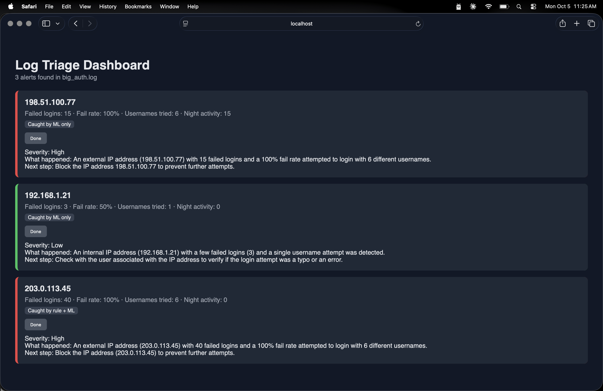

# AI Security Log Triage Tool

A Python tool that finds SSH attacks in Linux logs and uses AI to explain each alert.

## What it does
- **Rules:** flags IPs with many fast failed logins (brute force)
- **Machine learning:** uses Isolation Forest to catch sneaky attacks the rules miss
- **AI explanations:** a local AI model (Llama 3.2 via Ollama) rates each alert Low, Medium, or High and suggests a next step
- **Database:** saves alerts in SQLite

## Example
The ML found a slow nighttime attacker that the brute-force rule missed. The AI correctly rated a normal user's typo as Low severity.

## Tools used
Python, scikit-learn, Ollama, SQLite, regex

## How to run
python3 make_test_log.py
python3 ai_explainer.py big_auth.log

## Coming next
- Web dashboard
- Testing on real logs from a home lab

